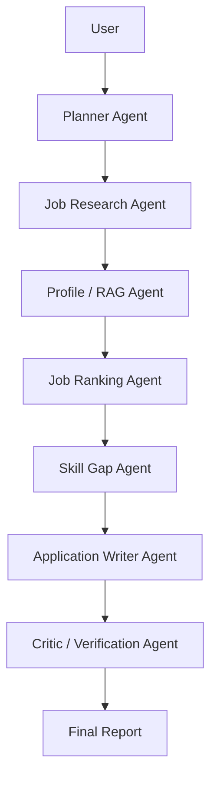

# CareerPilot AI

## Overview

CareerPilot AI is an agentic AI job-search and application assistant being built as an
internship portfolio project. It will research jobs, retrieve verified user profile
information, rank opportunities, identify skill gaps, draft tailored application material,
and verify generated claims.

**The project currently contains the Phase 1 foundation.** It deliberately does not make
LLM calls, ingest resumes, rank jobs, or generate applications yet.

## Problem

Candidates repeatedly research roles, compare requirements with their background, and
rewrite similar application material. CareerPilot explores how a transparent agent workflow
can assist without inventing experience or automatically submitting anything.

## Planned Architecture



FastAPI is the backend boundary, Streamlit is the user interface, SQLAlchemy owns
persistence, and Pydantic models define validated data contracts. Future agents will remain
outside route functions and will be coordinated explicitly with LangGraph.

## Current Features

- FastAPI application with `GET /health` and structured JSON errors.
- Configurable standard-library logging with no resume or secret logging.
- Validated environment settings; an OpenAI key is optional and unused in Phase 1.
- SQLAlchemy 2.x models and idempotent SQLite table initialization.
- Separate Pydantic API schemas and SQLAlchemy persistence models.
- Provider-neutral `JobProvider` interface.
- Deterministic offline provider backed by ten clearly fictional demo jobs.
- Query, location, remote-only, beginner-friendly, and result-limit filters.
- Clean seven-page Streamlit skeleton with a timeout-aware backend indicator.
- Offline tests, Docker/Compose development setup, and GitHub Actions CI.

## Planned Features

- Secure resume ingestion and profile RAG.
- Real job-provider adapters behind the existing interface.
- Transparent deterministic ranking and skill-gap analysis.
- Typed LangGraph orchestration with bounded retries and failure states.
- Grounded application drafts and critic verification.
- Evaluation metrics, run tracking, and reliability reporting.

## Technology Stack

- Python 3.11+
- FastAPI and Uvicorn
- Pydantic and Pydantic Settings
- SQLAlchemy and SQLite
- Streamlit and HTTPX
- pytest, pytest-asyncio, Ruff, and mypy
- Docker, Docker Compose, and GitHub Actions
- LangGraph and an OpenAI-compatible adapter in later phases

## Project Structure

```text
careerpilot-ai/
├── app/
│   ├── agents/              # LangGraph agents (Phase 4)
│   ├── api/                 # API router and small route modules
│   ├── core/                # Settings and logging
│   ├── db/
│   │   ├── models/          # Split SQLAlchemy models
│   │   ├── base.py
│   │   ├── init_db.py
│   │   └── session.py
│   ├── evaluation/          # Evaluation implementation (Phase 6)
│   ├── rag/                 # Profile retrieval (Phase 2)
│   ├── schemas/             # Pydantic request/response contracts
│   ├── services/            # Application services
│   ├── tools/jobs/          # Job provider interface and demo provider
│   └── main.py
├── data/mock_jobs.json      # Ten fictional demo opportunities
├── frontend/                # Streamlit homepage and seven pages
├── tests/                   # Offline foundation tests
├── scripts/init_db.py       # Idempotent table initializer
├── docs/                    # Architecture and dependency decisions
├── .github/workflows/ci.yml
├── .env.example
├── Dockerfile
├── docker-compose.yml
└── pyproject.toml
```

## Installation

```bash
python3 -m venv .venv
source .venv/bin/activate
python -m pip install --upgrade pip
pip install -e ".[dev]"
```

## Environment Setup

The defaults work without a local environment file. To customize them:

```bash
cp .env.example .env
```

| Variable | Default | Purpose |
|---|---|---|
| `APP_ENV` | `development` | Runtime environment label |
| `DEBUG` | `true` | FastAPI development debugging |
| `DATABASE_URL` | `sqlite:///./careerpilot.db` | SQLAlchemy connection URL |
| `OPENAI_API_KEY` | empty | Optional and unused in Phase 1 |
| `MAX_AGENT_RETRIES` | `2` | Future bounded workflow retries |
| `LLM_TIMEOUT_SECONDS` | `60` | Future LLM request timeout |
| `LOG_LEVEL` | `INFO` | Application logging threshold |
| `MAX_UPLOAD_SIZE_MB` | `5` | Future resume upload limit |
| `CAREERPILOT_API_URL` | `http://localhost:8000` | Backend URL used by Streamlit |

Never put a real key in `.env.example` or commit a local `.env` file.

## Initialize the Database

```bash
python scripts/init_db.py
```

The command is safe to run repeatedly. The API also initializes missing development tables
during startup.

## Running the API

```bash
uvicorn app.main:app --reload
```

The API is available at `http://localhost:8000`; interactive documentation is at
`http://localhost:8000/docs`.

## Running Streamlit

In a second terminal with the same virtual environment active:

```bash
streamlit run frontend/Home.py
```

The dashboard is available at `http://localhost:8501`. If the API is unavailable, the
homepage shows a friendly warning rather than crashing.

## Running Tests

```bash
pytest
```

Optional quality checks:

```bash
ruff check .
mypy app
```

## Docker

Run both services with SQLite:

```bash
docker compose up --build
```

No secrets are copied into the image. Compose provides the frontend with the internal API
address and persists the development database under `data/`.

## API

### `GET /health`

Successful response (`200 OK`):

```json
{
  "status": "ok",
  "service": "CareerPilot AI",
  "version": "0.1.0"
}
```

No placeholder endpoints are exposed for unfinished behavior.

## Roadmap

1. **Phase 1 — Foundation:** API, configuration, logging, database, schemas, mock provider,
   UI skeleton, tests, container baseline, and CI.
2. **Phase 2 — Profile ingestion and RAG:** safe PDF/TXT/Markdown extraction and retrieval.
3. **Phase 3 — Job search and ranking:** provider services and deterministic scoring.
4. **Phase 4 — Core LangGraph workflow:** planner, research, profile, and ranking nodes.
5. **Phase 5 — Writing and verification:** skill gaps, grounded drafts, critic, and bounded
   correction.
6. **Phase 6 — Evaluation and reliability:** scenarios, metrics, logs, and run tracking.
7. **Phase 7 — Delivery:** harden containers, CI, tests, documentation, and deployment.

## Security

- Secrets are read from environment variables and are excluded from Git.
- Settings mask the OpenAI API key if configuration is printed.
- Database files, caches, IDE files, and build artifacts are ignored.
- Resume uploads will be type-checked, size-limited, sanitized, and never executed in Phase 2.
- CareerPilot will generate drafts only; applications are never automatically submitted.
- Unexpected API errors are logged while clients receive a safe structured response.

## Limitations

- Every Phase 1 job is fictional demo data and is not an active opening.
- Search is deterministic keyword filtering, not semantic search or ranking.
- No resume ingestion, RAG, LLM, LangGraph, application writing, or evaluation execution is
  implemented yet.
- SQLite schema changes currently require recreating an empty development database;
  migrations will be introduced when persistence evolves.

## License

License selection is pending before public release.
