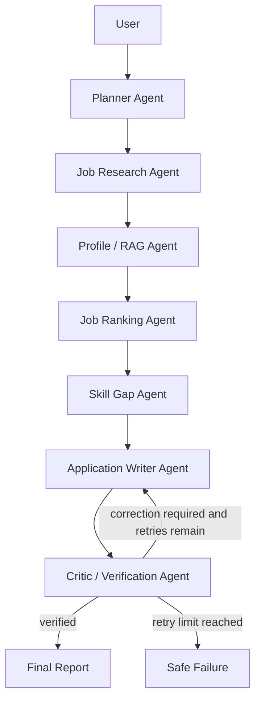

# CareerPilot AI

## Overview

CareerPilot AI is an agentic AI job-search and application assistant built as an internship
portfolio project. It can research demo jobs, retrieve verified user profile information,
rank opportunities, identify skill gaps, draft tailored application material, and verify
generated claims.

**Phases 1–7 are implemented.** The project works fully offline with deterministic fallbacks;
an OpenAI-compatible Responses API can optionally enhance structured planning and writing.

## Problem

Candidates repeatedly research roles, compare requirements with their background, and
rewrite similar application material. CareerPilot explores how a transparent agent workflow
can assist without inventing experience or automatically submitting anything.

## Architecture



FastAPI is the backend boundary, Streamlit is the user interface, SQLAlchemy owns
persistence, and Pydantic models define validated data contracts. LangGraph keeps every agent
node and conditional transition explicit.

## Current Features

- FastAPI application with `GET /health` and structured JSON errors.
- Configurable standard-library logging with no resume or secret logging.
- Safe PDF/TXT/Markdown resume ingestion and structured profile extraction.
- Modular FAISS RAG with persisted local profile indexes and deterministic embeddings.
- Validated settings and an optional OpenAI Responses API structured-output adapter.
- SQLAlchemy 2.x models and idempotent SQLite table initialization.
- Separate Pydantic API schemas and SQLAlchemy persistence models.
- Provider-neutral `JobProvider` interface.
- Deterministic offline provider backed by ten clearly fictional demo jobs.
- Query, location, remote-only, beginner-friendly, and result-limit filters.
- Fixed-weight job ranking with skills, experience, education, location, beginner, and project
  relevance factors.
- Explicit LangGraph workflow with typed state, validation, bounded retries, and failure states.
- Grounded skill gaps and application drafts checked by a critic before persistence.
- Ten-scenario evaluation runner with success, tools, latency, retries, consistency,
  hallucination, token, and cost metrics.
- Functional seven-page Streamlit dashboard with timeout-aware backend communication.
- 19 offline tests, Docker/Compose setup, and GitHub Actions CI.

## Future Improvements

- Add opt-in adapters for real job APIs behind the existing provider interface.
- Replace deterministic hashing embeddings with configurable hosted/local embeddings.
- Add Alembic migrations and PostgreSQL deployment support.
- Move long workflows to a background queue with streaming progress.
- Add authentication, multi-user authorization, and encrypted resume retention controls.

## Technology Stack

- Python 3.12+
- FastAPI and Uvicorn
- Pydantic and Pydantic Settings
- SQLAlchemy and SQLite
- Streamlit and HTTPX
- pytest, pytest-asyncio, Ruff, and mypy
- Docker, Docker Compose, and GitHub Actions
- LangGraph, FAISS, pypdf, OpenAI SDK, and Tenacity

## Project Structure

```text
careerpilot-ai/
├── app/
│   ├── agents/              # Typed LangGraph nodes, state, and routing
│   ├── api/                 # API router and small route modules
│   ├── core/                # Settings and logging
│   ├── db/
│   │   ├── models/          # Split SQLAlchemy models
│   │   ├── base.py
│   │   ├── init_db.py
│   │   └── session.py
│   ├── evaluation/          # Ten scenarios and aggregate metrics
│   ├── rag/                 # Modular FAISS profile retrieval
│   ├── schemas/             # Pydantic request/response contracts
│   ├── services/            # Ingestion, ranking, workflow, and writing use cases
│   ├── tools/jobs/          # Provider interface and deterministic demo provider
│   └── main.py
├── data/mock_jobs.json      # Ten fictional demo opportunities
├── frontend/                # Streamlit homepage and seven pages
├── tests/                   # Offline foundation tests
├── scripts/                 # DB initialization and evaluation report commands
├── docs/                    # Architecture and dependency decisions
├── .github/workflows/ci.yml
├── .env.example
├── Dockerfile
├── docker-compose.yml
└── pyproject.toml
```

## Installation

```bash
python3 -m venv .venv
source .venv/bin/activate
python -m pip install --upgrade pip
pip install -e ".[dev]"
```

## Environment Setup

The defaults work without a local environment file. To customize them:

```bash
cp .env.example .env
```

| Variable | Default | Purpose |
|---|---|---|
| `APP_ENV` | `development` | Runtime environment label |
| `DEBUG` | `true` | FastAPI development debugging |
| `DATABASE_URL` | `sqlite:///./careerpilot.db` | SQLAlchemy connection URL |
| `OPENAI_API_KEY` | empty | Optional structured LLM mode |
| `OPENAI_BASE_URL` | empty | Optional OpenAI-compatible base URL |
| `OPENAI_MODEL` | empty | Model used only when a key is configured |
| `MAX_AGENT_RETRIES` | `2` | Bounded critic and API retry count |
| `LLM_TIMEOUT_SECONDS` | `60` | Model request timeout |
| `LOG_LEVEL` | `INFO` | Application logging threshold |
| `MAX_UPLOAD_SIZE_MB` | `5` | Enforced resume upload limit |
| `CAREERPILOT_API_URL` | `http://localhost:8000` | Backend URL used by Streamlit |

Never put a real key in `.env.example` or commit a local `.env` file.

## Initialize the Database

```bash
python scripts/init_db.py
```

The command is safe to run repeatedly. The API also initializes missing development tables
during startup.

## Running the API

```bash
uvicorn app.main:app --reload
```

The API is available at `http://localhost:8000`; interactive documentation is at
`http://localhost:8000/docs`.

## Running Streamlit

In a second terminal with the same virtual environment active:

```bash
streamlit run frontend/Home.py
```

The dashboard is available at `http://localhost:8501`. If the API is unavailable, the
homepage shows a friendly warning rather than crashing.

## Running Tests

```bash
pytest
```

Optional quality checks:

```bash
ruff check .
mypy app
```

## Two-Minute Demo

1. Start FastAPI and Streamlit using the commands above.
2. Open **Profile** and upload a small PDF, TXT, or Markdown resume.
3. Open **Job Search** and search for remote beginner-friendly AI jobs in India.
4. Open **Job Recommendations** to inspect deterministic component scores.
5. Open **Agent Runs** and submit the example natural-language request.
6. Inspect **Skill Gaps**, generate a verified draft, and run **Evaluations**.

## Docker

Run both services with SQLite:

```bash
docker compose up --build
```

No secrets are copied into the image. Compose provides the frontend with the internal API
address and persists the development database under `data/`.

## Deploying as a Website

The repository includes `render.yaml`, which defines separate FastAPI and Streamlit web
services on Render. Both services build from the same Dockerfile, deploy after GitHub checks
pass, and communicate over Render's private network.

1. Open the Render Blueprint creation page for this repository.
2. Sign in with GitHub and authorize access to `taka2706/careerpilot-ai`.
3. Confirm the two free web services and select **Apply**.
4. Open the URL for `careerpilot-ai-web-taka2706` after both deploys are live.

An OpenAI key is optional. To enable LLM-backed structured writing, add
`OPENAI_API_KEY`, `OPENAI_MODEL`, and optionally `OPENAI_BASE_URL` only in the API service's
Render environment settings. Never add secrets to `render.yaml`.

The free deployment uses ephemeral SQLite and FAISS storage, so uploaded profiles and run
history can reset when Render restarts the service. PostgreSQL and persistent object/vector
storage are the recommended production upgrade.

## API

| Method | Endpoint | Purpose |
|---|---|---|
| GET | `/health` | Service health and version |
| POST | `/profiles` | Create a basic profile |
| POST | `/profiles/upload` | Validate, parse, store, and index a resume |
| GET | `/profiles/{id}` | Read structured profile data |
| POST | `/profiles/{id}/retrieve` | Retrieve relevant FAISS profile evidence |
| POST | `/jobs/search` | Search and persist deduplicated demo jobs |
| GET | `/jobs/{id}` | Read a job |
| POST | `/jobs/{id}/analyze` | Calculate and store deterministic scores |
| POST | `/agents/run` | Execute the complete LangGraph workflow |
| GET | `/runs` | List recent workflow runs |
| GET | `/runs/{id}` | Inspect one workflow run and report |
| POST | `/applications/generate` | Generate and verify application drafts |
| GET | `/evaluations` | Read aggregate evaluation metrics |
| POST | `/evaluations/run` | Execute all ten offline scenarios |

Interactive schemas and examples are available at `/docs`.

## Evaluation Metrics

Run and save a report with:

```bash
python scripts/run_evaluations.py
```

The report tracks task success rate, tool-call success, average execution time, retries,
ranking consistency, unsupported-claim rate, estimated tokens, and estimated cost. Offline
fallback runs correctly report zero API tokens and zero API cost.

## Roadmap

1. **Phase 1 — Foundation:** complete.
2. **Phase 2 — Profile ingestion and RAG:** complete.
3. **Phase 3 — Job search and deterministic ranking:** complete.
4. **Phase 4 — Core LangGraph workflow:** complete.
5. **Phase 5 — Writing, critic, and bounded correction:** complete.
6. **Phase 6 — Evaluation and reliability:** complete.
7. **Phase 7 — Containers, CI, tests, and documentation:** complete.

## Security

- Secrets are read from environment variables and are excluded from Git.
- Settings mask the OpenAI API key if configuration is printed.
- Database files, caches, IDE files, and build artifacts are ignored.
- Resume uploads are type-checked, size-limited, sanitized, parsed in memory, and never executed.
- CareerPilot will generate drafts only; applications are never automatically submitted.
- Unexpected API errors are logged while clients receive a safe structured response.

## Limitations

- Every bundled job is fictional demo data and is not an active opening.
- The default embedding is deterministic and local; it is appropriate for a portfolio demo,
  not a production semantic-search benchmark.
- Workflows run synchronously; production deployment should use a background worker.
- Authentication and multi-user data isolation are not implemented.
- SQLite is the development database; Alembic/PostgreSQL are the next persistence upgrades.

## Screenshots

- Dashboard overview — placeholder for repository screenshot.
- Deterministic score breakdown — placeholder for repository screenshot.
- LangGraph run report — placeholder for repository screenshot.
- Evaluation dashboard — placeholder for repository screenshot.

## License

License selection is pending before public release.
