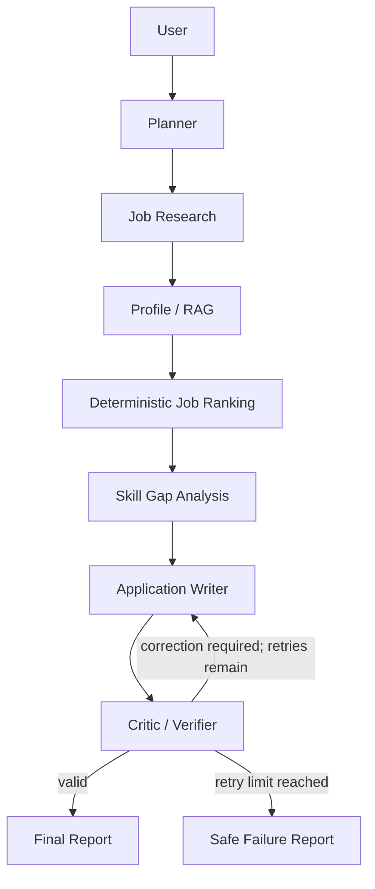

# CareerPilot AI

An autonomous AI job-search and application assistant built as an internship portfolio
project. CareerPilot will research suitable roles, compare them with a user's verified
profile, rank opportunities deterministically, identify skill gaps, generate grounded
application drafts, and verify its own output.

> **Current status:** Phase 1 foundation is runnable. AI workflows are intentionally not
> implemented yet.

## Why this project exists

Job seekers often repeat the same research, comparison, and writing work for every role.
CareerPilot demonstrates how a transparent, tool-using agent workflow can assist with that
work while keeping claims grounded in the user's resume and leaving submission to the user.

## Planned workflow



## Phase 1 features

- FastAPI application with `GET /health` and interactive API documentation.
- Environment-based, validated configuration.
- SQLAlchemy 2 models and automatic SQLite development setup.
- Typed Pydantic foundations for profiles, search preferences, and jobs.
- Three schema-validated mock jobs that require no external API.
- Professional seven-page Streamlit dashboard skeleton.
- Tests for health, database setup, and mock data integrity.
- Empty extension points for agents, RAG, tools, and evaluation work in later phases.

## Project structure

```text
careerpilot-ai/
├── app/
│   ├── agents/          # LangGraph nodes (Phase 4+)
│   ├── api/routes/      # FastAPI route modules
│   ├── core/            # Settings and shared infrastructure
│   ├── data/            # Bundled demo data
│   ├── db/              # Engine, sessions, initialization
│   ├── evaluation/      # Evaluation framework (Phase 6)
│   ├── models/          # SQLAlchemy models
│   ├── rag/             # Profile retrieval (Phase 2)
│   ├── schemas/         # Pydantic data contracts
│   ├── services/        # Use-case and business logic
│   ├── tools/           # Modular tool/provider interfaces
│   └── main.py          # FastAPI entry point
├── frontend/            # Streamlit application and pages
├── tests/               # Automated tests
├── docs/                # Architecture and dependency decisions
├── scripts/             # Development/maintenance scripts
├── data/                # Local runtime data (SQLite is Git-ignored)
├── .github/workflows/   # CI added in Phase 7
├── .env.example
└── pyproject.toml
```

## Quick start

Python 3.11-3.14 is supported.

```bash
cd careerpilot-ai
python3 -m venv .venv
source .venv/bin/activate
python -m pip install --upgrade pip
python -m pip install -e '.[dev]'
cp .env.example .env
```

Start the API in terminal 1:

```bash
uvicorn app.main:app --reload
```

Start the dashboard in terminal 2 (with the same virtual environment active):

```bash
streamlit run frontend/Home.py
```

Open the dashboard at `http://localhost:8501`, the API at `http://localhost:8000`, and
the generated API docs at `http://localhost:8000/docs`.

## Tests and quality checks

```bash
pytest
ruff check .
mypy app
```

## Environment variables

| Variable | Purpose | Default |
|---|---|---|
| `APP_NAME` | Display/API service name | `CareerPilot AI` |
| `APP_ENV` | Runtime environment label | `development` |
| `DEBUG` | FastAPI debug mode | `false` |
| `API_HOST` | API bind address | `0.0.0.0` |
| `API_PORT` | API port | `8000` |
| `DATABASE_URL` | SQLAlchemy database URL | `sqlite:///./data/careerpilot.db` |
| `BACKEND_URL` | API URL used by Streamlit | `http://localhost:8000` |

Copy `.env.example` to `.env`. Never commit `.env` or API keys.

## API endpoints

Phase 1 exposes only:

| Method | Endpoint | Purpose |
|---|---|---|
| GET | `/health` | Verify API availability and version |

Profile, job, workflow, application, run, and evaluation endpoints will be added in the
phase that implements their business behavior. This avoids placeholder endpoints that
pretend to work.

## Data and safety boundaries

- Mock job URLs use `example.com` and do not contact external providers.
- Uploaded files are not supported until validation and size limits arrive in Phase 2.
- CareerPilot will generate drafts only; it will never submit an application automatically.
- Secrets belong in local environment variables, never source control.

## Roadmap

1. **Foundation** — API, UI shell, database, schemas, mock data (complete).
2. **Profile ingestion and RAG** — safe PDF/TXT/Markdown extraction and retrieval.
3. **Job research and ranking** — provider interface and deterministic score engine.
4. **Core LangGraph workflow** — planner, research, profile, and ranking nodes.
5. **Writing and verification** — skill gaps, grounded drafts, critic, bounded correction.
6. **Evaluation and reliability** — metrics, scenarios, logging, run tracking.
7. **Delivery** — Docker, CI, broader tests, documentation, deployment preparation.

## Limitations

Phase 1 does not make LLM calls, ingest resumes, search live job sources, rank roles, or
generate application materials. Those capabilities will be added incrementally with tests.

## Technology stack

Python, FastAPI, Pydantic, SQLAlchemy, SQLite, Streamlit, HTTPX, pytest, Ruff, and mypy.
LangGraph, an OpenAI-compatible LLM adapter, and a modular vector store are planned for
their relevant phases.

## Screenshot placeholders

- Dashboard overview — add after interactive features are available.
- Transparent ranking breakdown — add in Phase 3.
- Agent run timeline — add in Phase 4.
- Evaluation report — add in Phase 6.

