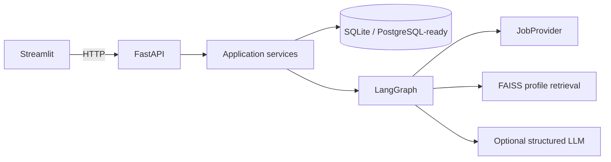
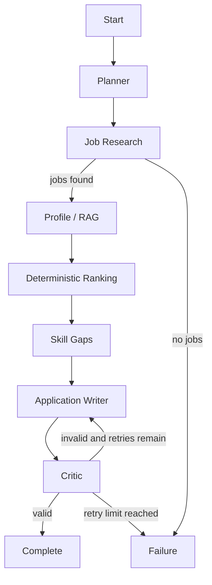

# CareerPilot AI Architecture

CareerPilot uses clear boundaries so each part can evolve without turning the API into one
large prompt or service.

## Agent workflow

`CareerPilotState` is a typed dictionary. Each node reads named fields and returns explicit
updates. The graph has completion and failure terminal nodes, and the critic route uses
`MAX_AGENT_RETRIES` to prevent infinite loops.

## API and UI separation

Streamlit owns presentation, local page state, and friendly error messages. FastAPI owns
validated contracts and application behavior. This allows another frontend to reuse the API
and prevents UI code from touching database sessions or agents directly.

## Services and agents

Routes create small services. Services coordinate persistence and domain operations. Agents
live under `app/agents/` and each has one responsibility: planning, research, profile
retrieval, ranking, skill gaps, writing, or verification. Agent prompts and HTTP handling are
never mixed together.

## Resume ingestion and RAG

PDF, TXT, and Markdown files are size checked and parsed in memory. Path components are
removed from filenames and uploads are never executed. A line-based parser extracts verified
education, skills, projects, experience, certifications, tools, and programming languages.

`ProfileVectorStore` makes retrieval implementation-independent. `FaissProfileStore` is the
current adapter. It uses deterministic hashing embeddings, cosine similarity through
`IndexFlatIP`, and one persisted local index per profile. A hosted embedding implementation
can replace it without changing the profile agent.

## Job providers and ranking

`JobProvider` prevents agents from depending on a specific jobs API. The demo provider reads
ten fictional listings and applies ordinary Python filters. The job service removes
duplicates by `(source, external_id)` before persistence.

Ranking is never chosen by an LLM. Fixed weights are skills 40%, experience 20%, education
15%, location 15%, beginner friendliness 5%, and project relevance 5%. The critic
recalculates the scores and compares missing required skills before accepting a draft.

## LLM abstraction

The offline planner and writer are complete deterministic fallbacks. When an API key and
model are configured, `OpenAIResponsesLLM` requests Pydantic structured output through the
Responses API with `store=False`, a configured timeout, exponential backoff for transient
connection/rate-limit failures, and bounded attempts. An LLM failure falls back locally.

## Persistence

SQLAlchemy 2.x models store profiles, jobs, rankings, drafts, runs, errors, and evaluations.
SQLite requires no server for a portfolio demo. PostgreSQL later needs a driver, a new
`DATABASE_URL`, and Alembic migrations; application services remain unchanged.

## Reliability and security

- Request schemas validate limits and types.
- Upload size/type checks happen before parsing.
- API clients and LLM calls have timeouts.
- Unexpected errors use a safe JSON envelope and protected server logs.
- API keys, resume bodies, and personal data are not written to logs.
- The graph has explicit failure routes and bounded correction.
- Evaluation runs offline and verifies ranking consistency and unsupported claims.
- Applications are drafts only and are never submitted automatically.
