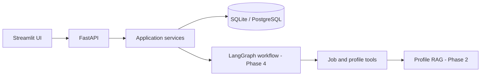

# Architecture

CareerPilot AI separates HTTP concerns, business logic, persistence, AI orchestration,
retrieval, and presentation. Each layer communicates through typed schemas.

The `agents`, `rag`, `tools`, and `evaluation` packages are intentional extension points.
They remain small until their implementation phases so the project stays runnable.

