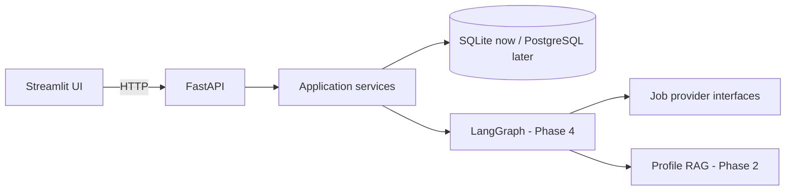

# CareerPilot AI Architecture

This document describes the intended boundaries in beginner-friendly terms. Phase 1 creates
the boundaries but does not pretend that later AI behavior already exists.

## Why FastAPI and Streamlit are separate

Streamlit owns presentation: forms, progress indicators, tables, and reports. FastAPI owns
validated HTTP contracts and application behavior. This lets another frontend or automated
client use the same backend later.

## Why agents do not live in API routes

Routes should validate a request, call an application service, and shape a response. Agent
workflows can be slow, retry, or fail partway through. Keeping agents under `app/agents/`
prevents route modules from becoming large prompts mixed with HTTP and database code.

## Why job providers use an interface

`JobProvider` defines the stable `search_jobs` contract. `MockJobProvider` fulfills it using
local JSON, so development and tests need no internet or paid API. A real provider can later
implement the same contract without changing the planner or ranking engine.

## Why ranking will be deterministic

An LLM should not invent an unexplained score. Phase 3 will calculate every score from fixed
weights and normalized profile/job evidence. An LLM may explain those numbers, but the
explanation must agree with the calculation.

## Why SQLAlchemy is used

SQLAlchemy provides typed Python models and isolates most database-specific connection code.
Development uses SQLite because it requires no server. Changing `DATABASE_URL`, adding a
PostgreSQL driver, and introducing migrations later will enable PostgreSQL without rewriting
business logic. JSON columns are sufficient for small skill lists now.

## How LangGraph will be added

Phase 4 will define a typed graph state and explicit nodes for planning, research, profile
retrieval, and ranking. Conditional edges will handle validation, retries, and failure states.
No graph dependency is installed in Phase 1 because there is no graph behavior to run yet.

## How RAG will be added

Phase 2 will safely extract text from PDF, TXT, and Markdown resumes, structure verified
profile facts, chunk useful passages, and access a vector store through a small interface.
ChromaDB or FAISS and PDF dependencies are deferred until that implementation exists.

## Failure and security baseline

API validation errors and unexpected errors share a stable JSON envelope. Unexpected errors
are logged with method, path, and exception type, but not request bodies, API keys, or resume
text. Generated databases and environment files are ignored by Git. Application submission
will remain a manual user action.
